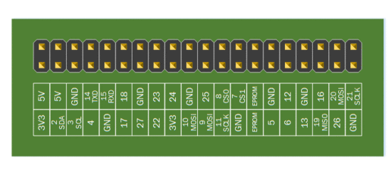

GPIO (Gagnapinnar)
==================

.. image:: gpio-pinout.png

Bættu við *dtoverlay=w1–gpio* neðst í skrána.

.. code-block:: bash
    
    $ sudo nano /boot/config.txt

Hlöðum inn tvo rekla (*drivers*) til að túlka gögnin frá skynjurunum.

.. code-block:: python
    
    sudo modprobe w1-gpio
    sudo modprobe w1-therm

Þegar skynjari finnst er búinn til mappa með sama nafni og auðkenni hans.

.. code-block:: bash

    $ cd /sys/bus/w1/devices
    $ ls
    $ cd 28*
    $ cat w1_slave

Brjótum þetta niður og staðfærum yfir í Python. Búðu til skrána *verkefni14.py* og byrjum á að hlaða inn reklana.

.. code-block:: python
    
    # -*- coding: utf-8 -*-

    import os
    
    def mod_probe():
        os.system('modprobe w1-gpio')
        os.system('modprobe w1-therm')

    mod_probe()

Bætum við öðru falli sem finnur skynjarann:

.. code-block:: python

    # -*- coding: utf-8 -*-

    import os
    import glob  

    # Finna af skynjara
    def find_sensor(sensor_id=None):
        base = '/sys/bus/w1/devices/'
        data_file = 'w1_slave'

        if sensor_id:
            sensor = os.path.join(base, sensor_id, data_file)
        
        else:
            try:
                folder = glob.glob(base + '28*')[0]            
            except IndexError:
                print('Enginn skynjari fannst!')
                return
            else:
                sensor = os.path.join(folder, data_file)

        return sensor

    
    # Hlaða inn rekla
    def mod_probe():
        os.system('modprobe w1-gpio')
        os.system('modprobe w1-therm')

    mod_probe()
    sensor = find_sensor()

    

Búum til fallið *start()* sem sér um að kalla í nauðsynleg föll til að undirbúa lestur.

.. code-block:: python

    # -*- coding: utf-8 -*-

    import os
    import glob  
    
    # Finna af skynjara
    def find_sensor(sensor_id=None):
        base = '/sys/bus/w1/devices/'
        data_file = 'w1_slave'

        if sensor_id:
            sensor = os.path.join(base, sensor_id, data_file)
        
        else:
            try:
                folder = glob.glob(base + '28*')[0]            
            except IndexError:
                print('Enginn skynjari fannst!')
                return
            else:
                sensor = os.path.join(folder, data_file)

        return sensor

    
    # Hlaða inn rekla
    def mod_probe():
        os.system('modprobe w1-gpio')
        os.system('modprobe w1-therm')

    def start():
        mod_probe()
        #sensor = find_sensor('28-0000058e596b')
        sensor = find_sensor()
        print(find_sensor(sensor))

    start()

Bætum við fallinu *read_sensor()* til að lesa af skynjaranum.

.. code-block:: python

    # -*- coding: utf-8 -*-

    import os
    import glob  

    # Lesa af skynjara
    def read_sensor(sensor):
        f = open(sensor, 'r')
        lines = f.read().splitlines()
        f.close()
        return lines

    # Finna af skynjara
    def find_sensor(sensor_id=None):
        base = '/sys/bus/w1/devices/'
        data_file = 'w1_slave'

        if sensor_id:
            sensor = os.path.join(base, sensor_id, data_file)
        
        else:
            try:
                folder = glob.glob(base + '28*')[0]            
            except IndexError:
                print('Enginn skynjari fannst!')
                return
            else:
                sensor = os.path.join(folder, data_file)

        return sensor

    
    # Hlaða inn rekla
    def mod_probe():
        os.system('modprobe w1-gpio')
        os.system('modprobe w1-therm')

    def start():
        mod_probe()
        #sensor = find_sensor('28-0000058e596b')
        sensor = find_sensor()

        # Prentum út gögn frá skynjara
        print(read_sensor(sensor))

    start()

Bætum við fallinu *get_temp_from_data()* til að sækja hitastig úr textastrengnum sem skynjarinn skilar okkur.

.. code-block:: python

    # -*- coding: utf-8 -*-

    import os
    import glob  

    # Sækja hitastig úr gögnum

    def get_temp_from_data(data):
        print(data[1])

    # Lesa af skynjara
    def read_sensor(sensor):
        f = open(sensor, 'r')
        lines = f.read().splitlines()
        f.close()
        return lines

    # Finna af skynjara
    def find_sensor(sensor_id=None):
        base = '/sys/bus/w1/devices/'
        data_file = 'w1_slave'

        if sensor_id:
            sensor = os.path.join(base, sensor_id, data_file)
        
        else:
            try:
                folder = glob.glob(base + '28*')[0]            
            except IndexError:
                print('Enginn skynjari fannst!')
                return
            else:
                sensor = os.path.join(folder, data_file)

        return sensor

    # Hlaða inn rekla
    def mod_probe():
        os.system('modprobe w1-gpio')
        os.system('modprobe w1-therm')

    def start():
        mod_probe()
        #sensor = find_sensor('28-0000058e596b')
        sensor = find_sensor()

        # Prentum út gögn frá skynjara
        data = read_sensor(sensor) # Setja gögn frá skynjara í breytu
        temp = get_temp_from_data(data) # Sækja hitastig úr gögnum

    start()

Í listanum eru tvö sæti. Við viljum síðustu 5 tölurnar í síðara sætinu.

.. code-block:: python

    # -*- coding: utf-8 -*-

    import os
    import glob  

    # Sækja hitastig úr gögnum

    def get_temp_from_data(data):
        temp = data[1][-5:]
        print(temp)

    # Lesa af skynjara
    def read_sensor(sensor):
        f = open(sensor, 'r')
        lines = f.read().splitlines()
        f.close()
        return lines

    # Finna af skynjara
    def find_sensor(sensor_id=None):
        base = '/sys/bus/w1/devices/'
        data_file = 'w1_slave'

        if sensor_id:
            sensor = os.path.join(base, sensor_id, data_file)
        
        else:
            try:
                folder = glob.glob(base + '28*')[0]            
            except IndexError:
                print('Enginn skynjari fannst!')
                return
            else:
                sensor = os.path.join(folder, data_file)

        return sensor

    # Hlaða inn rekla
    def mod_probe():
        os.system('modprobe w1-gpio')
        os.system('modprobe w1-therm')

    def start():
        mod_probe()
        #sensor = find_sensor('28-0000058e596b')
        sensor = find_sensor()

        # Prentum út gögn frá skynjara
        data = read_sensor(sensor) # Setja gögn frá skynjara í breytu
        temp = get_temp_from_data(data) # Sækja hitastig úr gögnum

    start()

Í listanum eru tvö sæti. Við viljum síðustu 6 tölurnar í síðara sætinu.

.. code-block:: python

    # -*- coding: utf-8 -*-

    import os
    import glob  

    # Sækja hitastig úr gögnum

    def get_temp_from_data(data):
        temp = data[1][-6:]

    # Lesa af skynjara
    def read_sensor(sensor):
        f = open(sensor, 'r')
        lines = f.read().splitlines()
        f.close()
        return lines

    # Finna af skynjara
    def find_sensor(sensor_id=None):
        base = '/sys/bus/w1/devices/'
        data_file = 'w1_slave'

        if sensor_id:
            sensor = os.path.join(base, sensor_id, data_file)
        
        else:
            try:
                folder = glob.glob(base + '28*')[0]            
            except IndexError:
                print('Enginn skynjari fannst!')
                return
            else:
                sensor = os.path.join(folder, data_file)

        return sensor

    # Hlaða inn rekla
    def mod_probe():
        os.system('modprobe w1-gpio')
        os.system('modprobe w1-therm')

    def start():
        mod_probe()
        #sensor = find_sensor('28-0000058e596b')
        sensor = find_sensor()

        # Prentum út gögn frá skynjara
        data = read_sensor(sensor) # Setja gögn frá skynjara í breytu
        temp = get_temp_from_data(data) # Sækja hitastig úr gögnum

    start()

Í listanum eru tvö sæti. Við viljum síðustu 5 tölurnar í síðara sætinu.

.. code-block:: python

    # -*- coding: utf-8 -*-

    import os
    import glob  

    # Sækja hitastig úr gögnum

    def get_temp_from_data(data):
        temp = data[1][-5:]
        print(temp)

    # Lesa af skynjara
    def read_sensor(sensor):
        f = open(sensor, 'r')
        lines = f.read().splitlines()
        f.close()
        return lines

    # Finna af skynjara
    def find_sensor(sensor_id=None):
        base = '/sys/bus/w1/devices/'
        data_file = 'w1_slave'

        if sensor_id:
            sensor = os.path.join(base, sensor_id, data_file)
        
        else:
            try:
                folder = glob.glob(base + '28*')[0]            
            except IndexError:
                print('Enginn skynjari fannst!')
                return
            else:
                sensor = os.path.join(folder, data_file)

        return sensor

    # Hlaða inn rekla
    def mod_probe():
        os.system('modprobe w1-gpio')
        os.system('modprobe w1-therm')

    def start():
        mod_probe()
        #sensor = find_sensor('28-0000058e596b')
        sensor = find_sensor()

        # Prentum út gögn frá skynjara
        data = read_sensor(sensor) # Setja gögn frá skynjara í breytu
        temp = get_temp_from_data(data) # Sækja hitastig úr gögnum

    start()

Þetta gæti orðið hættulegt því við vitum ekki hvernig tölurnar breytast. Það væri öruggara að skipta upp strengnum á *=* merkinu og sækja allt hægra meginn við merkið.

.. code-block:: python

    # -*- coding: utf-8 -*-

    import os
    import glob  

    # Sækja hitastig úr gögnum
    def get_temp_from_data(data):
        temp_list = data[1].split('=') # Splittum strengnum á = merkinu
        temp = temp_list[1] # Sækjum síðari hlutann strengsins.
        print(temp)
        return temp

    # Lesa af skynjara
    def read_sensor(sensor):
        f = open(sensor, 'r')
        lines = f.read().splitlines()
        f.close()
        return lines

    # Finna af skynjara
    def find_sensor(sensor_id=None):
        base = '/sys/bus/w1/devices/'
        data_file = 'w1_slave'

        if sensor_id:
            sensor = os.path.join(base, sensor_id, data_file)
        
        else:
            try:
                folder = glob.glob(base + '28*')[0]            
            except IndexError:
                print('Enginn skynjari fannst!')
                return
            else:
                sensor = os.path.join(folder, data_file)

        return sensor

    # Hlaða inn rekla
    def mod_probe():
        os.system('modprobe w1-gpio')
        os.system('modprobe w1-therm')

    def start():
        mod_probe()
        #sensor = find_sensor('28-0000058e596b')
        sensor = find_sensor()

        # Prentum út gögn frá skynjara
        data = read_sensor(sensor) # Setja gögn frá skynjara í breytu
        temp = get_temp_from_data(data) # Sækja hitastig úr gögnum

    start()

Sækjum celsius og fahrenheit föllinn okkar frá því í síðasta kafla og aðlögum þau að nýja kóðanum okkar.

.. code-block:: python

    # -*- coding: utf-8 -*-

    import os
    import glob  

    def calculate_celsius(temp=None):
        if temp:
            return float(temp) / 1000.0
        return None

    def calculate_fahrenheit(temp=None):
        if temp:
            return temp * 1.8 + 32
        return None

    # Sækja hitastig úr gögnum
    def get_temp_from_data(data):
        temp_list = data[1].split('=')
        temp = temp_list[1]
        print(temp)
        return temp

    # Lesa af skynjara
    def read_sensor(sensor):
        f = open(sensor, 'r')
        lines = f.read().splitlines()
        f.close()
        return lines

    # Finna af skynjara
    def find_sensor(sensor_id=None):
        base = '/sys/bus/w1/devices/'
        data_file = 'w1_slave'

        if sensor_id:
            sensor = os.path.join(base, sensor_id, data_file)
        
        else:
            try:
                folder = glob.glob(base + '28*')[0]            
            except IndexError:
                print('Enginn skynjari fannst!')
                return
            else:
                sensor = os.path.join(folder, data_file)

        return sensor

    # Hlaða inn rekla
    def mod_probe():
        os.system('modprobe w1-gpio')
        os.system('modprobe w1-therm')

    def start():
        mod_probe()
        #sensor = find_sensor('28-0000058e596b')
        sensor = find_sensor()

        # Prentum út gögn frá skynjara
        data = read_sensor(sensor) # Setja gögn frá skynjara í breytu
        temp = get_temp_from_data(data) # Sækja hitastig úr gögnum. Hitastigið er í celsius * 1000

        celsius = calculate_celsius(temp) # Deilum með 1000 til að fá rétta tölu í celsius
        fahrenheit = calculate_fahrenheit(celsius) # Sendum rétt celsius hitastig í fahrenheit fallið til.

        db_data = {'fahrenheit': fahrenheit, 'celsius': celsius} # Búum til orðasafn úr gögnunum.
        print(db_data)

    start()

Setjum dagsetningu og tíma með færslunni.

.. code-block:: python

    # -*- coding: utf-8 -*-

    import os
    import glob  
    from datetime import datetime # Sækjum datetime módúluna

    def calculate_celsius(temp=None):
        if temp:
            return float(temp) / 1000.0
        return None

    def calculate_fahrenheit(temp=None):
        if temp:
            return temp * 1.8 + 32
        return None

    # Sækja hitastig úr gögnum
    def get_temp_from_data(data):
        temp_list = data[1].split('=')
        temp = temp_list[1]
        print(temp)
        return temp

    # Lesa af skynjara
    def read_sensor(sensor):
        f = open(sensor, 'r')
        lines = f.read().splitlines()
        f.close()
        return lines

    # Finna af skynjara
    def find_sensor(sensor_id=None):
        base = '/sys/bus/w1/devices/'
        data_file = 'w1_slave'

        if sensor_id:
            sensor = os.path.join(base, sensor_id, data_file)
        
        else:
            try:
                folder = glob.glob(base + '28*')[0]            
            except IndexError:
                print('Enginn skynjari fannst!')
                return
            else:
                sensor = os.path.join(folder, data_file)

        return sensor

    # Hlaða inn rekla
    def mod_probe():
        os.system('modprobe w1-gpio')
        os.system('modprobe w1-therm')

    def start():
        mod_probe()
        #sensor = find_sensor('28-0000058e596b')
        sensor = find_sensor()

        # Prentum út gögn frá skynjara
        data = read_sensor(sensor) # Setja gögn frá skynjara í breytu
        temp = get_temp_from_data(data) # Sækja hitastig úr gögnum. Hitastigið er í celsius * 1000

        celsius = calculate_celsius(temp) # Deilum með 1000 til að fá rétta tölu í celsius
        fahrenheit = calculate_fahrenheit(celsius) # Sendum rétt celsius hitastig í fahrenheit fallið til.

        db_data = {
            'fahrenheit': fahrenheit, 
            'celsius': celsius,
            'datetime': datetime.now() # Setjum dagsetningu og tíma með færslunni.
        } 
        
        print(db_data)

    start()

Fjölmargir gagnagrunnar eru í boði til að geyma þessar upplýsingar. Í þessu verkefni munum við nota gagnagrunninn *TinyDB*. Fyrir flóknari gögn og stærra verkefni yrði æskilegra að nota öflugri grunna.

Byrjum á að sækja TinyDB með *pip*:

.. code-block:: bash
    
    $ pip3 install tinydb --user

Hlöðum inn TinyDB módúlunni í kóðann okkar.

.. code-block:: python

    # -*- coding: utf-8 -*-

    import os
    import glob  
    from datetime import datetime
    from tinydb import TinyDB, Query # Sækjum TinyDB módúluna
    import json

    db = TinyDB('db.json')

    def calculate_celsius(temp=None):
        if temp:
            return float(temp) / 1000.0
        return None

    def calculate_fahrenheit(temp=None):
        if temp:
            return temp * 1.8 + 32
        return None

    # Sækja hitastig úr gögnum
    def get_temp_from_data(data):
        temp_list = data[1].split('=')
        temp = temp_list[1]
        print(temp)
        return temp

    # Lesa af skynjara
    def read_sensor(sensor):
        f = open(sensor, 'r')
        lines = f.read().splitlines()
        f.close()
        return lines

    # Finna af skynjara
    def find_sensor(sensor_id=None):
        base = '/sys/bus/w1/devices/'
        data_file = 'w1_slave'

        if sensor_id:
            sensor = os.path.join(base, sensor_id, data_file)
        
        else:
            try:
                folder = glob.glob(base + '28*')[0]            
            except IndexError:
                print('Enginn skynjari fannst!')
                return
            else:
                sensor = os.path.join(folder, data_file)

        return sensor

    # Hlaða inn rekla
    def mod_probe():
        os.system('modprobe w1-gpio')
        os.system('modprobe w1-therm')

    def start():
        mod_probe()
        #sensor = find_sensor('28-0000058e596b')
        sensor = find_sensor()

        # Prentum út gögn frá skynjara
        data = read_sensor(sensor) # Setja gögn frá skynjara í breytu
        temp = get_temp_from_data(data) # Sækja hitastig úr gögnum. Hitastigið er í celsius * 1000

        celsius = calculate_celsius(temp) # Deilum með 1000 til að fá rétta tölu í celsius
        fahrenheit = calculate_fahrenheit(celsius) # Sendum rétt celsius hitastig í fahrenheit fallið til.

        db_data = {
            'fahrenheit': fahrenheit, 
            'celsius': celsius,
            'datetime': str(datetime.now()) # Breytum datetime gagnatípunni í streng.
        } 

        print(db_data)
        db.insert(db_data)

    start()

Forritið okkar les aðeins einu sinni af skynjaranum í stað þess að lesa af honum endalaust. Lögum það.

.. code-block:: python

    # -*- coding: utf-8 -*-

    import os
    import glob  
    from datetime import datetime
    from tinydb import TinyDB, Query # Sækjum TinyDB módúluna
    import json
    import time

    db = TinyDB('db.json')

    def calculate_celsius(temp=None):
        if temp:
            return float(temp) / 1000.0
        return None

    def calculate_fahrenheit(temp=None):
        if temp:
            return temp * 1.8 + 32
        return None

    # Sækja hitastig úr gögnum
    def get_temp_from_data(data):
        temp_list = data[1].split('=')
        temp = temp_list[1]
        print(temp)
        return temp

    # Lesa af skynjara
    def read_sensor(sensor):
        f = open(sensor, 'r')
        lines = f.read().splitlines()
        f.close()
        return lines

    # Finna af skynjara
    def find_sensor(sensor_id=None):
        base = '/sys/bus/w1/devices/'
        data_file = 'w1_slave'

        if sensor_id:
            sensor = os.path.join(base, sensor_id, data_file)
        
        else:
            try:
                folder = glob.glob(base + '28*')[0]            
            except IndexError:
                print('Enginn skynjari fannst!')
                return
            else:
                sensor = os.path.join(folder, data_file)

        return sensor

    # Hlaða inn rekla
    def mod_probe():
        os.system('modprobe w1-gpio')
        os.system('modprobe w1-therm')

    def start():
        mod_probe()
        #sensor = find_sensor('28-0000058e596b')
        sensor = find_sensor()

        while True: # Nú les forritið okkar endalaust af skynjaranum.
            # Prentum út gögn frá skynjara
            data = read_sensor(sensor) # Setja gögn frá skynjara í breytu
            temp = get_temp_from_data(data) # Sækja hitastig úr gögnum. Hitastigið er í celsius * 1000

            celsius = calculate_celsius(temp) # Deilum með 1000 til að fá rétta tölu í celsius
            fahrenheit = calculate_fahrenheit(celsius) # Sendum rétt celsius hitastig í fahrenheit fallið til.

            db_data = {
                'fahrenheit': fahrenheit, 
                'celsius': celsius,
                'datetime': str(datetime.now()) # Köstum gildinu úr datetime gagnatípunni yfir í streng.
            } 

            print(db_data)
            db.insert(db_data)
            time.sleep(3)

    start()
