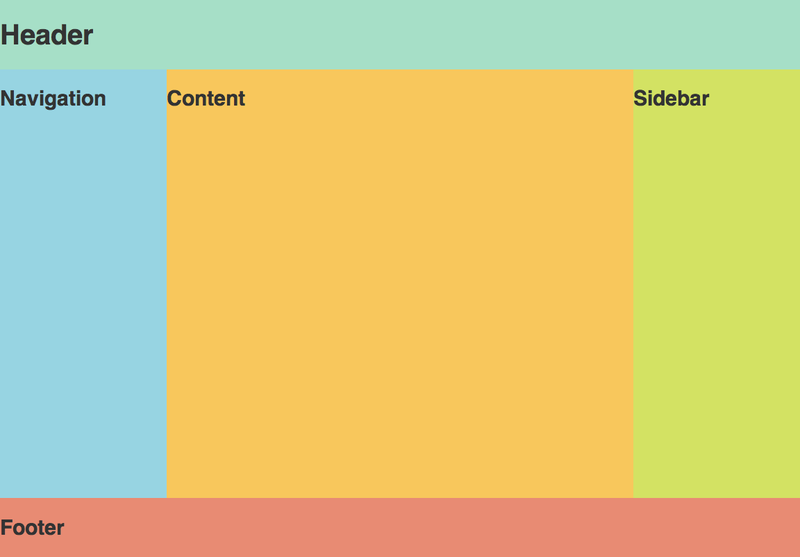

Skoðum Layout
=============

Þegar við erum að byggja vefsíðu með HTML og CSS erum við lang oftast með í huga eitthverskonar uppsetingu sem við viljum hafa á síðunni. Það sem við ætlum að skoða núna eru nokkrar mismunandi uppsetningar á vefsíðum, en mikilvægt er að hafa í huga að þetta er algerlega opið og vefsíður þurfa alls ekki að fylgja hinni eða þessari uppsetingu frekar en þið viljið.

Þessi kafli er meira miðaður að hönnun en nokkuð annað sem við förum yfir á þessu námskeiði

**Heilagi kaleikurinn**

Fyrsta uppsetingin sem við munum fjalla um er "Heilagi kaleikurinn". Þessi uppseting er með fjóra megin hluta: haus, valmynd, hlið, aðalmynd og fót. Hausinn á að vera fastur efst og fóturinn á að vera fastur niðri. Síðan á valmyndin og hliðin að falla sitt hvoru megin við aðalmyndina. 

Mynd:

Uppsetning HTML taganna getur þá farið eitthvað á þennan veginn:

.. code-block:: HTML

    <!DOCTYPE html>
    <html>
        <head>
            <title>Hérna er texti</title>
        </head>
        <body>
             <header>
                 Hérna kemur haus skjalsins
             </header>
             <main>
                 <nav>
                     Hérna kemur valmyndin
                 </nav>
                 

                     Hérna er aðal efni vefsíðunnar
                 

                 <aside>
                     Hérna kemur hliðin
                 </aside>
             </main>
             <footer>
                 Fótur vefsins fer hingað
             </footer>
        </body>
    </html>

Hérna eru síðan CSS stýlarnir sem blása lífi í uppsetninguna.

.. code-block:: CSS

    header{
        
    }

Verkefni 3
----------

* Búum til layout samkvæmt LINKUR AÐ MYND
* Skoðum layout þekktra vefsíðna
* Betrumbætum beinagrindina okkar